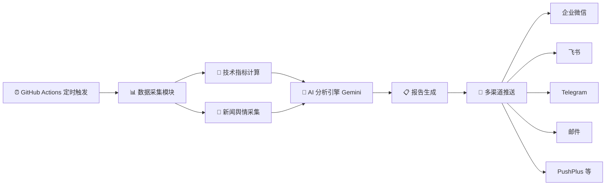
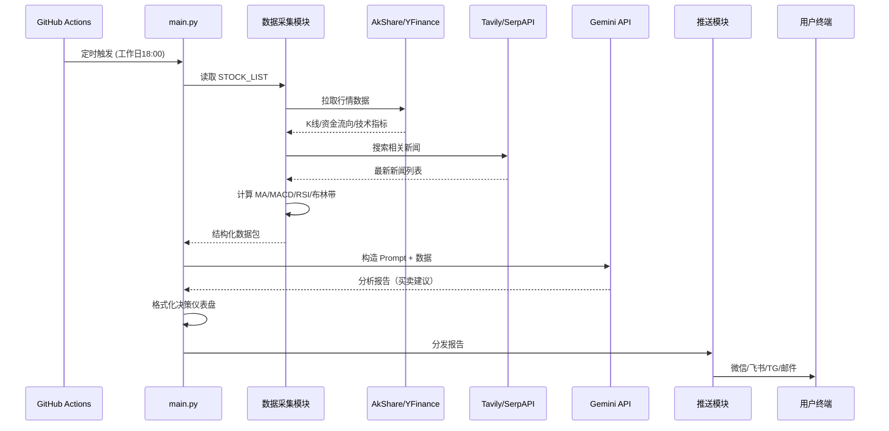

## `daily_stock_analysis` 项目技术实现原理分析

> **项目地址**：https://github.com/ZhuLinsen/daily_stock_analysis  
> **定位**：LLM 驱动的 A/H/美股智能分析器，零成本、纯白嫖、定时运行  
> **Star 数**：7000+

---

### 一、整体架构概览

这个项目的核心思路可以用一句话概括：**利用 GitHub Actions 的免费算力，定时拉取股票行情和新闻数据，喂给 AI 大模型（Gemini）生成结构化的投资分析报告，再通过多渠道推送给用户。**



---

### 二、核心技术模块拆解

#### 1. 调度层 — GitHub Actions（零成本的秘密）

项目最巧妙的设计就是**把 GitHub Actions 当作免费的定时任务调度器**，省去了服务器和 Cron 的成本。

```yaml
# .github/workflows/daily_analysis.yml 大致结构
name: Daily Stock Analysis
on:
  schedule:
    - cron: '0 10 * * 1-5'  # UTC 10:00 = 北京时间 18:00，工作日执行
  workflow_dispatch:  # 支持手动触发

jobs:
  analyze-stocks:
    runs-on: ubuntu-latest
    steps:
      - uses: actions/checkout@v4
      - name: Install dependencies
        run: pip install -r requirements.txt
      - name: Run analysis
        env:
          GEMINI_API_KEY: ${{ secrets.GEMINI_API_KEY }}
          STOCK_LIST: ${{ secrets.STOCK_LIST }}
        run: python main.py
```

**关键点**：
- 公开仓库的 GitHub Actions **完全免费、无限制**
- 敏感信息（API Key、股票列表）通过 GitHub Secrets 注入环境变量
- 默认在 A 股收盘后（18:00）自动运行

#### 2. 数据采集层 — 多源行情 + 实时新闻

数据采集是分析的基础，项目支持多个免费数据源：

| 数据类型 | 数据源 | 说明 |
|---------|--------|------|
| A 股行情 | **AkShare** / Pytdx | 免费开源，无需注册 |
| 港股/美股 | **YFinance** | Yahoo Finance 数据接口 |
| A 股高级数据 | **Tushare Pro** | 可选付费源，更稳定 |
| 实时新闻 | **Tavily** / SerpAPI | 搜索引擎 API 获取最新资讯 |

**数据采集核心流程**：

```python
# 伪代码展示核心逻辑
def fetch_data(stock_list):
    for symbol in stock_list:
        # 1. 根据股票代码前缀判断市场类型
        if symbol.startswith('hk'):
            data = yfinance.download(symbol)      # 港股
        elif symbol.isalpha():
            data = yfinance.download(symbol)      # 美股
        else:
            data = akshare.stock_zh_a_hist(symbol) # A股
        
        # 2. 获取资金流向、龙虎榜等辅助数据
        fund_flow = akshare.stock_fund_flow(symbol)
        
        # 3. 抓取相关新闻
        news = tavily.search(f"{stock_name} 最新消息")
        
    return merged_data
```

#### 3. 技术指标计算层

在拿到原始行情数据后，项目会计算一系列经典技术指标，作为 AI 分析的输入依据：

- **均线系统**：MA5 / MA20 / MA60（判断短中长期趋势）
- **MACD**：快慢线交叉信号（金叉/死叉）
- **RSI**：相对强弱指数（超买>70 / 超卖<30）
- **布林带**：价格波动区间（突破上/下轨信号）
- **乖离率 BIAS**：价格偏离均线程度（>5% 触发风险提示）
- **成交量分析**：量能变化趋势

这些指标会被**格式化为结构化文本**，作为 Prompt 的一部分喂给 AI 模型。

#### 4. AI 分析引擎 — Prompt Engineering 是核心

这是整个项目**最关键的部分**。技术实现本质上是一个精心设计的 **Prompt Engineering** 工程：

```python
def analyze_with_gemini(model, symbol, tech_data, news_data):
    prompt = f"""
你是一位资深金融分析师，请根据以下数据为 {symbol} 生成投资分析：

【技术指标】
- 收盘价：{tech_data['close']}
- MA5/MA20/MA60：{tech_data['ma5']}/{tech_data['ma20']}/{tech_data['ma60']}
- 均线排列：{'多头排列 ✓' if bullish else '空头排列 ✗'}
- MACD：{tech_data['macd']}（{'金叉' if golden_cross else '死叉'}）
- RSI：{tech_data['rsi']}
- 乖离率：{tech_data['bias']}%
- 成交量变化：{tech_data['volume_change']}

【近期新闻】
{news_summary}

【资金流向】
{fund_flow_data}

请按以下结构输出：
1. 操作建议（买入/观望/卖出）
2. 建议买入价位
3. 止损价位
4. 目标价位
5. 核心分析逻辑
6. 风险提示

要求：内置交易纪律，乖离率>5%时必须提示追高风险。
"""
    response = model.generate_content(prompt)
    return parse_response(response.text)
```

**Prompt 设计的几个关键策略**：

1. **角色设定**：让 Gemini 扮演"资深金融分析师"
2. **结构化输入**：技术指标、新闻、资金流向分模块喂入
3. **结构化输出**：明确要求输出买入价/止损价/目标价等具体数值
4. **内置交易纪律**：在 Prompt 中硬编码风控规则（如乖离率>5%提示风险）
5. **多维度融合**：技术面 + 消息面 + 资金面，让 AI 做综合判断

**模型支持**：
- **默认**：Google Gemini（`gemini-2.0-flash` 等，免费额度充足）
- **可选**：DeepSeek、通义千问、Moonshot 等兼容 OpenAI API 格式的模型

#### 5. 报告生成 — 决策仪表盘

AI 分析结果会被格式化为一个**视觉化的决策仪表盘**：

```
┌─────────────────────────────────┐
│  📊 贵州茅台 (600519)  决策仪表盘  │
├─────────────────────────────────┤
│  操作建议：🟢 买入                  │
│  建议买入：1680-1700 元            │
│  止损价位：1650 元                 │
│  目标价位：1780 元                 │
│                                   │
│  ✅ 多头排列    ✅ MACD金叉         │
│  ✅ RSI健康     ⚠️ 乖离率偏高       │
│  ✅ 量能充足    ✅ 舆情正面          │
│                                   │
│  📰 近期利好：茅台发布业绩预增公告    │
│  ⚠️ 风险提示：近期涨幅较大注意回调    │
└─────────────────────────────────┘
```

使用 **matplotlib** 生成图表图片，结合 emoji 和颜色标记（🟢买入 / 🟡观望 / 🔴卖出）来提升移动端阅读体验。

#### 6. 多渠道推送层

支持 8 种通知渠道，采用**插件式设计**，每个渠道一个独立模块：

| 渠道 | 实现方式 |
|------|---------|
| 企业微信 | Webhook 机器人 |
| 飞书 | Webhook 机器人 |
| Telegram | Bot API |
| 邮件 | SMTP |
| PushPlus | HTTP API |
| Pushover | HTTP API |
| 钉钉 | Webhook |
| 自定义 Webhook | HTTP POST |

**关键技术细节**：企业微信有 2048 字节限制，项目实现了**消息智能分片算法**，将长报告自动拆分成多条消息发送。

---

### 三、完整数据流



---

### 四、技术亮点总结

| 亮点 | 说明 |
|------|------|
| **零成本架构** | GitHub Actions（免费算力）+ Gemini（免费额度）+ AkShare（免费数据），整套系统无需花一分钱 |
| **Prompt 即策略** | 分析逻辑的核心不是写代码逻辑，而是设计 Prompt——把技术指标、新闻、资金数据结构化后喂给 LLM，由 LLM 做综合判断 |
| **多数据源融合** | 技术面（K线指标）+ 消息面（实时新闻）+ 资金面（资金流向）三维度融合分析 |
| **模块化设计** | 数据源、AI 模型、推送渠道都是可插拔的，换一个 API Key 就能切换底层实现 |
| **内置风控** | 在 Prompt 层面硬编码交易纪律（乖离率过高提示风险等），避免 AI 无脑追涨 |

---

### 五、本质理解

这个项目的**技术本质**可以概括为：

> **一个将"传统量化分析数据"转化为"LLM Prompt 输入"的管道工程。**

它并没有自己实现复杂的量化交易策略或模型训练，而是：
1. 用 Python 生态（AkShare/YFinance）抓数据
2. 用经典公式算技术指标
3. 把所有数据**结构化地塞进 Prompt**
4. 让 Gemini 这类通用 LLM 来做**"综合研判"**这件事
5. 最后把结果推送出去

**创新点不在算法，而在工程整合**——把免费资源（GitHub Actions + Gemini 免费额度 + 开源数据源）巧妙地串联起来，形成了一个对个人投资者非常实用的零成本自动化工具链。
